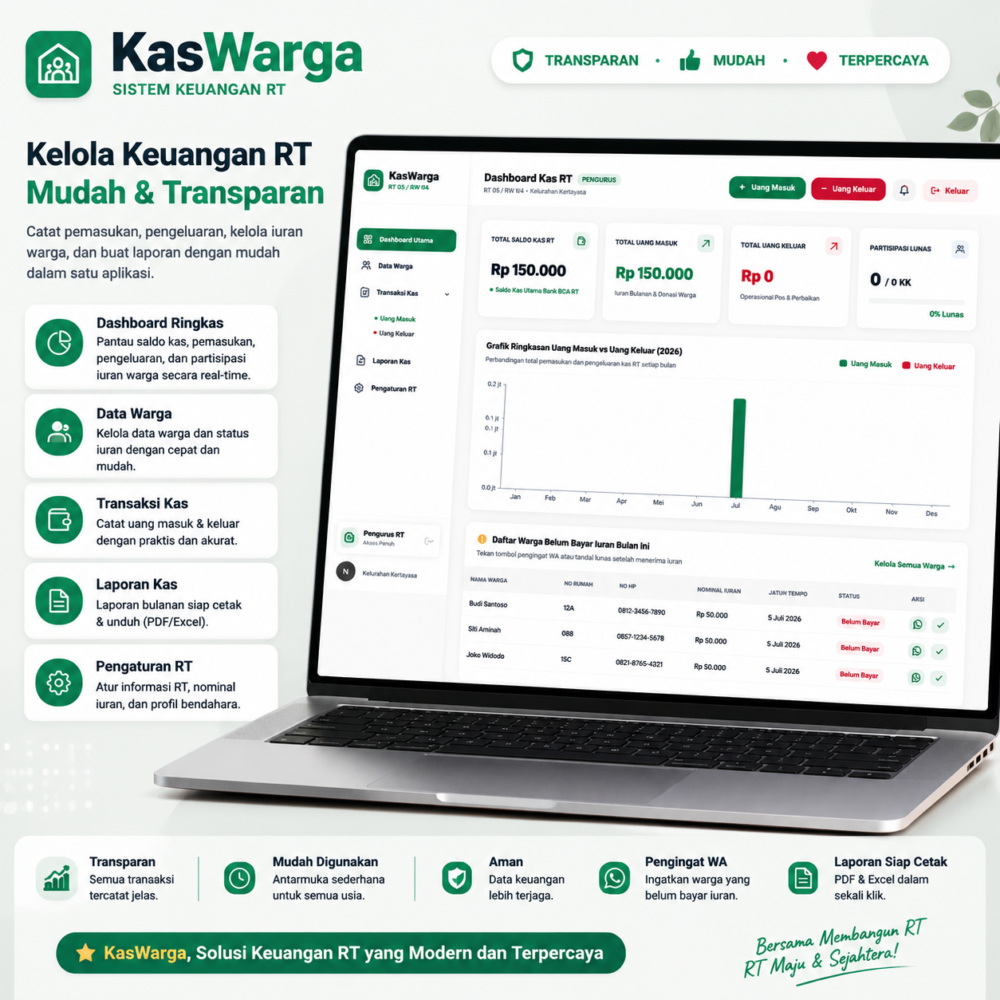

# 🏡 Kenalkan KasWarga!

Sistem keuangan RT yang membantu pengurus mengelola administrasi dan keuangan warga dengan lebih mudah, transparan, dan terpercaya.

Tidak perlu lagi mencatat secara manual. Dengan KasWarga, seluruh aktivitas RT dapat dikelola dalam satu aplikasi.

## 🛠️ Teknologi Utama

## ✨ Fitur utama:
✅ Dashboard keuangan RT secara real-time
✅ Catat uang masuk & uang keluar dengan mudah
✅ Kelola data warga dan status pembayaran iuran
✅ Pantau warga yang belum membayar iuran
✅ Kelola bantuan sosial dan data penerima bantuan secara transparan
✅ Catat riwayat penerimaan bantuan setiap warga
✅ Buat laporan kas secara otomatis (PDF & Excel)

**💚 Transparan • Mudah • Terpercaya**

Dengan KasWarga, pengurus RT dapat bekerja lebih efektif dan warga dapat memperoleh informasi yang lebih jelas mengenai pengelolaan keuangan serta bantuan sosial di lingkungan sekitar.

🌱 **KasWarga — Solusi Keuangan RT yang Modern dan Terpercaya**

